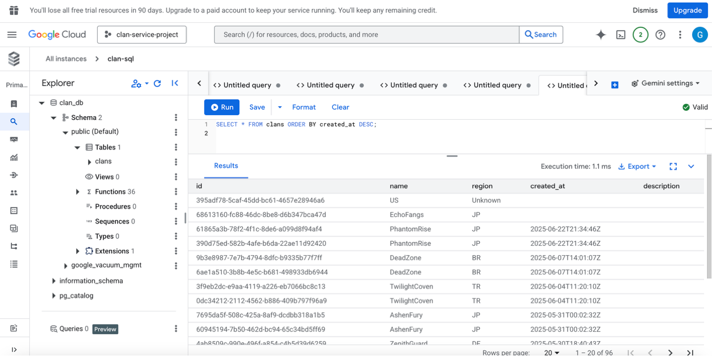
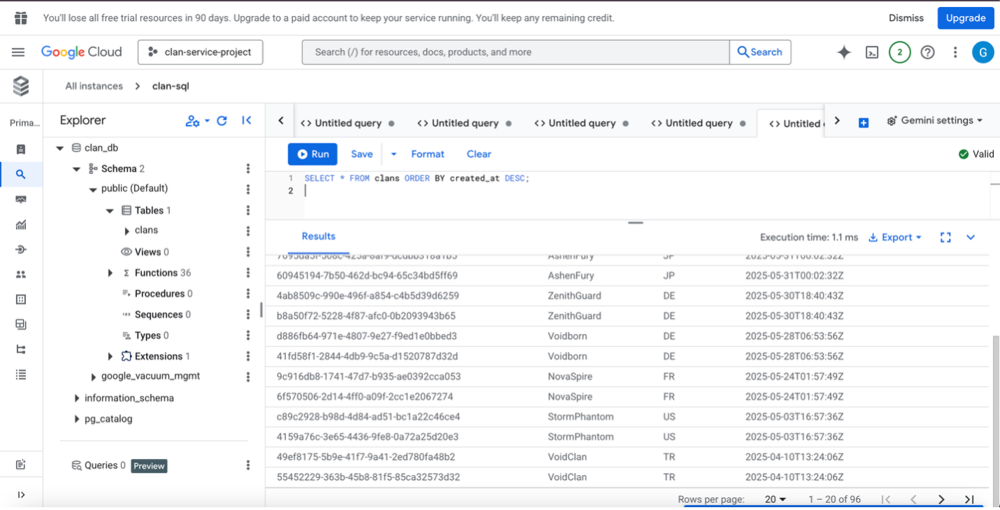
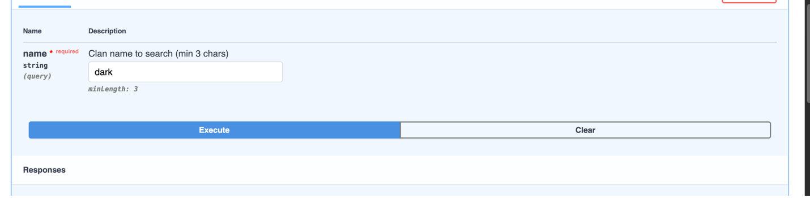
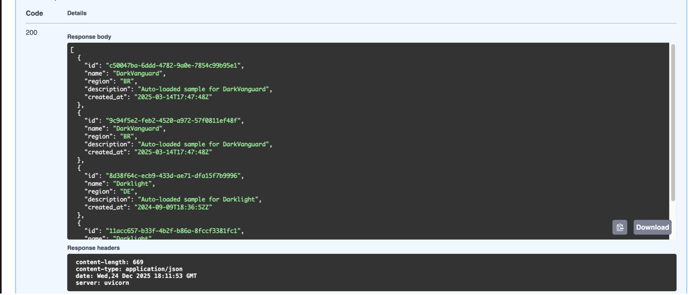
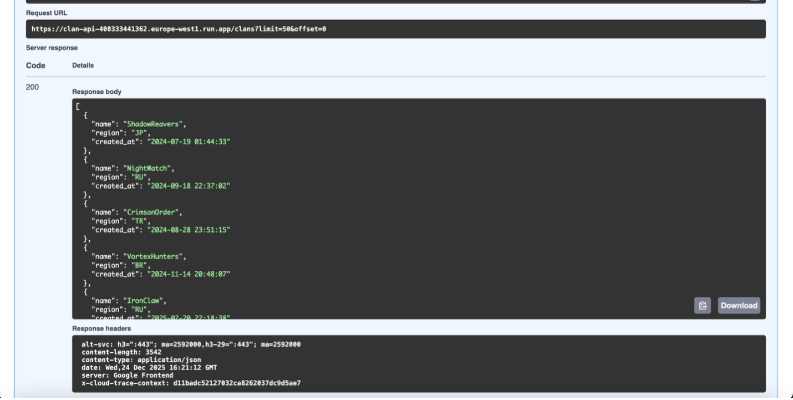
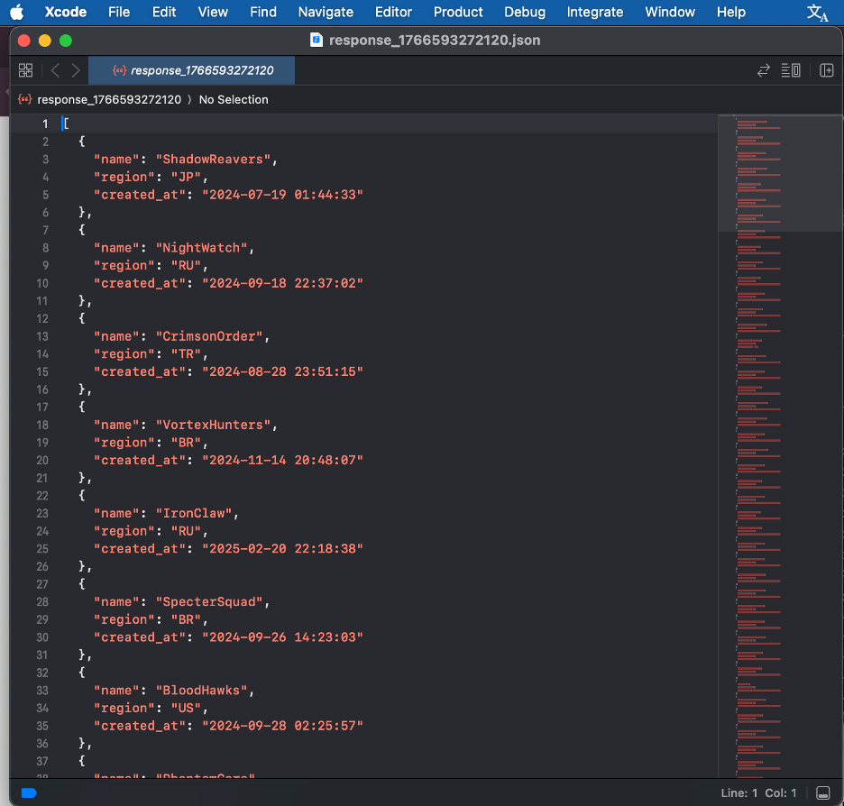
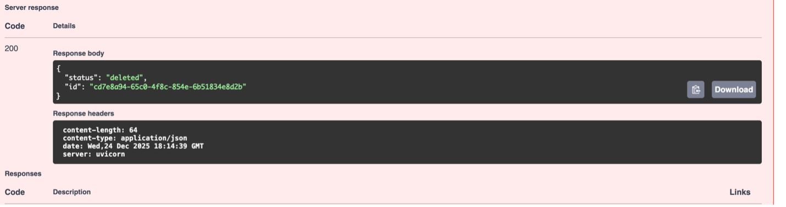

# Vertigo Games – Data Engineer Case Study

This repository contains my solution for the **Vertigo Games Data Engineer Case**, which consists of two main parts:

- **Part 1:** Backend API for Clan Management  
- **Part 2:** Analytics Modeling with DBT & Business Visualization

---

## PART 1 – Clan Service API

This document describes the complete implementation of the **Clan Service API**, a lightweight backend designed to manage game clans.  
It is built with **FastAPI**, **PostgreSQL**, and **Docker**, deployed on **Google Cloud Run**, using **Cloud SQL** for data storage.  
All results are returned as JSON responses.

The goal of this project is to evaluate backend development skills, database design, and cloud-native deployment experience.

---

### The API Allows

- Create a clan (with a name and region)  
- List clans (with pagination)  
- Find clans by name (min 3 letters, partial match)  
- Delete a specific clan by ID  

Each clan record has:

- A unique UUID identifier (`id`)  
- A UTC timestamp (`created_at`) automatically generated on creation  

---

### Database Schema

```sql
CREATE TABLE clans (
    id UUID PRIMARY KEY DEFAULT gen_random_uuid(),
    name VARCHAR(100) NOT NULL,
    region VARCHAR(10),
    created_at TIMESTAMP WITH TIME ZONE DEFAULT CURRENT_TIMESTAMP
);
```

---

### `.env` Configuration

```
DB_USER=postgres
DB_PASSWORD=postgres
DB_NAME=clandb
DB_HOST=db
DB_PORT=5432
```

---

### Docker Setup

```bash
docker compose up -d --build
docker ps
# clan_api and clan_postgres should both be "running"
```

**Sample CSV:** `clan_sample_data.csv`

```bash
docker exec -it clan_api python sample_data_loader.py
docker exec -it clan_postgres psql -U postgres -d clandb -c "SELECT COUNT(*) FROM clans;"
```

---

### API Endpoints

#### 1. Create Clan

**POST** `/clans`
```json
{
  "name": "DarkPhoenix",
  "region": "TR"
}
```

**Response**
```json
{
  "id": "bb7cf17a-5ab1-4c62-89cc-7d8301bb76c9",
  "name": "DarkPhoenix",
  "region": "TR",
  "created_at": "2025-12-24T21:12:33Z"
}
```

---

#### 2. List Clans

**GET** `/clans?limit=50&offset=0`
```json
[
  {"name": "ShadowReavers", "region": "JP", "created_at": "2024-07-19T01:44:33Z"},
  {"name": "NightWatch", "region": "RU", "created_at": "2024-09-18T22:37:02Z"}
]
```

---

#### 3. Search Clan by Name

**GET** `/clans/search?name=dark`
```json
[
  {
    "id": "c50047ba-6ddd-4782-9a0e-7854c99b5e31",
    "name": "DarkVanguard",
    "region": "BR",
    "created_at": "2025-03-14T17:47:48Z"
  },
  {
    "id": "8d38f64c-ecb3-4334-ae71-dfa15f7b3996",
    "name": "DarkLight",
    "region": "DE",
    "created_at": "2024-09-09T18:36:52Z"
  }
]
```

---

#### 4. Delete Clan by ID

**DELETE** `/clans/{id}`
```json
{
  "status": "deleted",
  "id": "cd7e0a94-65c0-4f8c-854c-6b518348e02b"
}
```

---

### Deployment on Google Cloud Run & Cloud SQL

#### Database
Cloud SQL (PostgreSQL 15) instance: **clan-sql** with database **clandb**.

#### API Deployment
```bash
gcloud run deploy clan-api \
    --source . \
    --platform managed \
    --region europe-west1 \
    --add-cloudsql-instances clan-sql \
    --allow-unauthenticated
```

**Public Endpoint:**  
```
https://clan-api-xxxxxxxxxxxx.europe-west1.run.app/clans
```

---

### Example SQL Queries (Cloud SQL Studio)

```sql
SELECT name, region, created_at
FROM clans
ORDER BY created_at DESC
LIMIT 10;

SELECT COUNT(*) FROM clans;
```

---

### Example CLI Usage

```bash
# List clans
curl "http://localhost:8000/clans?limit=10&offset=0" | jq .

# Search clan
curl "http://localhost:8000/clans/search?name=dark" | jq .

# Delete clan
curl -X DELETE "http://localhost:8000/clans/{id}" | jq .
```

---

### Screenshots

#### Cloud SQL Query
  


#### Swagger UI – List Clans
  


#### Swagger UI – Search Clan
  


#### Swagger UI – Delete Clan


---

## PART 2 – Analytics & Dashboards

Additional exports of the dashboards are available in **PDF format** under the `reports/` directory:

- [Match Performance PDF](reports/Match_Performance.pdf)

---

### Dashboard Pages

#### User Engagement Overview
- DAU trend over time  
- DAU by country  

#### Revenue Overview
- Total IAP & Ad revenue  
- Revenue split by platform  
- Revenue trends over time  

#### Match Performance
- Matches started  
- Win / Defeat ratios  
- Match activity trends  

#### System Health
- Server connection errors per DAU  
- Stability trends over time  
